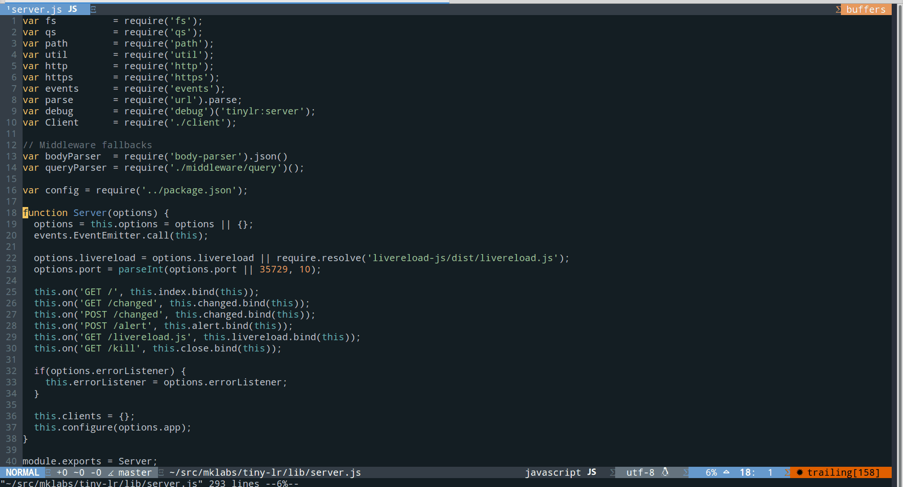

<h1 align="center">
	
	<br>
	<br>
</h1>

---

> Lightweight bag of utilities for NeoVim JavaScript developers

---

- A carefully crafted set of [plugins](./docs/plugins.md) for JavaScript development with [nvim][]
- [Sensible][] defaults and Syntax files for ES5 / ES6
- Awesome JS completion using [deoplete][] and [Tern][]
- Super fast asynchronous linting with [neomake][]
- Shortcut commands to interact with npm & node
- Ability to hit `Ctrl+R` to launch current file with node
- Wrappers to popular JavaScript task runners like [Grunt] or [Gulp]
- Same goodies for popular JavaScript test runners such as [Mocha] or [Ava]
- A good amount of [UltiSnips][] snippets for ES6 & React
- A bunch of templates (init new buffers with arbitrary content)

## Install

Install [vim-plug][] and put this line into your `.vimrc`

```
Plug 'vimlab/neojs'
```

On first launch, it will install the list of plugins defined in [plugin/plugins.md](./plugin/plugins.vim).

1. Close vim and reopen
2. Run `:PlugStatus` to check your install and list of bundles
4. Run `:Unite menu` or hit `<space><space>` to open the top Unite menu
5. Profit

## Plugins

The file `plugin/plugins.vim` uses vim-plug API to dynamically load the following plugins:

- **[vim-sensible][]** A universal set of defaults that (hopefully) everyone can agree on.
- **[unite][]** Unite is used to provide fuzzy finder like feature for various source
- **[neomake][]** Neovim's Syntasic equivalent. Asynchronous linting using Neovim's job-control functionality
- **[deoplete][]** Provides an asynchronous keyword completion system in the current buffer
- **[ternjs][]** Tern based JavaScript editing support
- **[deoplete-ternjs][]** deoplete source for javascript using Tern
- **[vim-javascript][]** JavaScript bundle for vim, this bundle provides syntax and indent plugins
- **[yajs.vim][]** Yet Another JavaScript Syntax file
- **[es.next.syntax.vim][]** Syntax file is for ES7 and future syntax
- **[mdn.vim][]**  Query http://mdn.io and see the Markdown result in a vertical buffer
- **[jscs.vim][]** `jscs -x` command: `:Format` can take range or operate on the whole file
- **[split-term.vim][]** Utilites around neovim's `:terminal`
- **[vim-node][]** Tools to make Vim superb for developing with Node
- **[node-host][]** [Neovim's remote
  plugin](https://neovim.io/doc/user/remote_plugin.html) feature is kinda cool.
  It is now possible to author neovim plugins using JavaScript and node only.
  See [this page](./docs/remote-plugin.md) for more informations on how to
  create your own node plugin, or browse
  [mdown.vim](https://github.com/vimlab/mdown.vim) code which is an experiment
  on using neovim's and [node-host][] remote API.

[vim-sensible]: https://github.com/tpope/vim-sensible
[Unite]: https://github.com/Shougo/unite.vim
[UltiSnips]: https://github.com/SirVer/ultisnips
[Neomake]: https://github.com/benekastah/neomake
[deoplete]: https://github.com/Shougo/deoplete.nvim
[ternjs]: https://github.com/ternjs/tern_for_vim
[deoplete-ternjs]: https://github.com/carlitux/deoplete-ternjs
[es.next.syntax.vim]: https://github.com/othree/es.next.syntax.vim
[mdn.vim]: https://github.com/vimlab/mdn.vim
[jscs.vim]: https://github.com/vimlab/jscs.vim
[split-term.vim]: https://github.com/vimlab/split-term.vim
[vim-node]: https://github.com/moll/vim-node
[t.vim]: https://github.com/vimlab/t.vim
[node-host]: https://github.com/neovim/node-host
[Fugitive]: https://github.com/tpope/vim-fugitive

When necessary, configuration for a given plugin can be found in
`plugin/<plugin>.vim` (ex. [plugin/neomake.vim](./plugin/neomake.vim)).

## Unite Menus

[Unite][] is an awesome plugin for advanced VIM users. It offers a rich API to
compose and design UI, in a simple way.

[oh-my-vim] and [joedicastro's
dotfiles](https://github.com/joedicastro/dotfiles/tree/master/vim) had the
briliant idea of using Unite to define a list of Menus with available commands
and mappings, which inspired the following:

- lint - Linter with neomake
- node - Node & npm menu
- task - Task helpers (Grunt & Gulp)
- tern - Tern commands (https://github.com/ternjs/tern_for_vim)
- test - Test helpers (Mocha & Ava)

**Ex.**


---

### Node

[vim-node][] already provides excellent support for node developement.

[plugin/node.vim](./plugin/node.vim) adds a few more goodies:

- `:NodeRun` command to open a vertical `:terminal` buffer with `node` command.
  The current buffer is executed and the result displayed.

- `Ctrl+R` is the default mapping to run `:NodeRun`

- `:Node <args>` opens a 2-lines horizontal buffer with node prompt

- `:Require <args>` helper to quickly add new require statements

### npm

- `:Npm <command> [options]` Wrapper on top of `npm`.

- `:Npmi packages...` alias for `:Npm install <args> --save`, except that it opens
  an horizontal buffer with only two lines displayed.

### Snippets

A list of [UltiSnips][] snippets can be found in the [snippets](./snippets)
directory.

- Common snippets like `f)`, `()()` to create IIFE, `#!` to expand node
  shebang, `ok` for `Object.keys()`, `e`, `l` to expand `console.`

- ES6 snippets from https://github.com/isRuslan/vim-es6/tree/master/UltiSnips

- React snippets from https://github.com/bentayloruk/vim-react-es6-snippets

Run `:UltiSnipsEdit` to edit them or add additional ones.

### Templates

[t.vim][] is a small "template" or scaffolding tool.

It takes a list of template files from `~/.vim/templates` and use them to
initialize new buffer from predefined content.

Mustache like placeholders can be used to quickly jump from one item to
another. With a little more work, [t.vim][] will ask the user for values to
quickly replace `{{ var }}`.

See [templates/](./templates) directory to see the list of available
templates.

You can add more templates in `~/.vim/templates`. The filename is important:
Use `<language>.<ext>` for a generic template to use for a particular filetype.
Any other name can be used for a more specific template. `package.json` is a
good example.


## Configuration

- `g:neojs_bundles` Path to vim-plug plugin directories (`~/.vim/bundles`)
- `g:neojs_unite_delimiter` Change the prefix value used in Unite Menus
- `g:neojs_pluginfile` Path to the file listing plugins to install and load
  (`~/.vim/bundles/neojs/docs/plugins.md`)

---

[vim-plug]: https://github.com/junegunn/vim-plug
[Unite]: https://github.com/Shougo/unite.vim
[UltiSnips]: https://github.com/SirVer/ultisnips
[Neomake]: https://github.com/benekastah/neomake
[deoplete]: https://github.com/Shougo/deoplete.nvim
[Tern]: https://ternjs.net
[ternjs]: https://github.com/ternjs/tern_for_vim
[deoplete-ternjs]: https://github.com/carlitux/deoplete-ternjs
[vim-javascript]: https://github.com/pangloss/vim-javascript
[yajs.vim]: https://github.com/othree/yajs.vim
[es.next.syntax.vim]: https://github.com/othree/es.next.syntax.vim
[mdn.vim]: https://github.com/vimlab/mdn.vim
[jscs.vim]: https://github.com/vimlab/jscs.vim
[split-term.vim]: https://github.com/vimlab/split-term.vim
[vim-node]: https://github.com/moll/vim-node
[t.vim]: https://github.com/vimlab/t.vim
[node-host]: https://github.com/neovim/node-host
[Fugitive]: https://github.com/tpope/vim-fugitive
[neovim]: https://github.com/neovim/neovim
[nvim]: https://github.com/neovim/neovim
[ava]: https://github.com/sindresorhus/ava
[Mocha]: https://mochajs.org/
[Grunt]: http://gruntjs.com/
[Gulp]: http://gulpjs.com/
[vim-sensible]: https://github.com/tpope/vim-sensible
[Sensible]: https://github.com/tpope/vim-sensible
[oh-my-vim]: https://github.com/liangxianzhe/oh-my-vim
